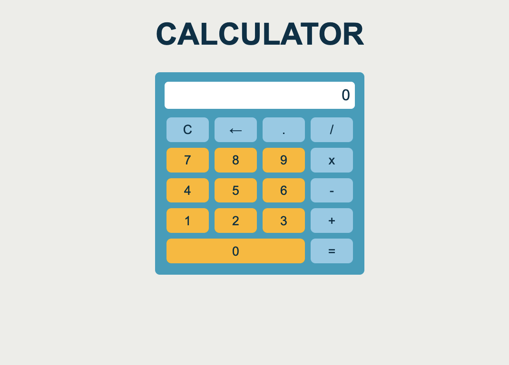

# Calculator

## Description

Welcome to my little calculator! In an effort to keep coding, I decided to build this calculator using vanilla JavaScript.

## Screenshot

## Built With

- JavaScript
- CSS
- HTML

## Future Improvements

- Light and dark mode
- Keyboard clicks show an effect on the appropriate buttons
  
## Credits

- Favicon: [Calculator icons created by Pixel perfect - Flaticon](https://www.flaticon.com/free-icons/calculator)
